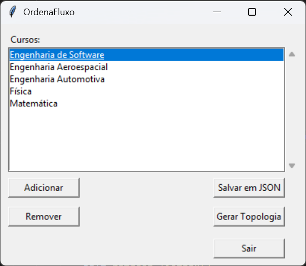
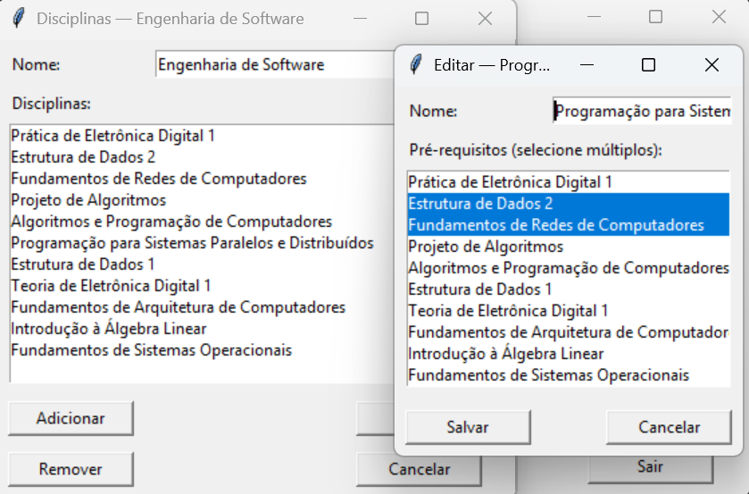
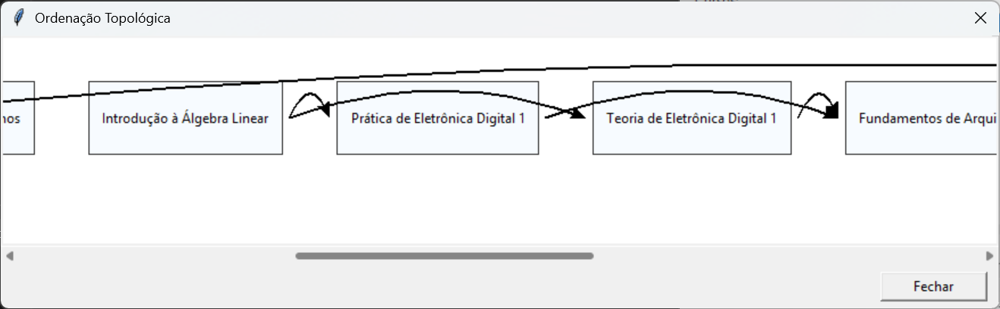

# OrdenaFluxo 📑

## Sobre 

O *OrdenaFluxo* é resultado do trabalho da [**Dupla 30**](#alunos) no primeiro módulo (*Grafos 1*) da disciplina de *Projeto de Algoritmos*, na *Universidade de Brasília (UnB/FCTE)*. Nesse sentido, foi utilizada a possível relação entre disciplinas em um curso como um *grafo direcionado acíclico*, de forma que possa ser gerada uma *ordenação topológica* do grafo.

Para isso, foi construída uma interface simples voltada para organização de disciplinas em um curso com 10 períodos. Basta inserir as disciplinas, configurar seus pré requisitos e será gerado um fluxo de matérias que você poderá seguir! A seguir, estão listadas algumas das funcionalidades implementadas:

- Criação, remoção, atualização e visualização de cursos e de disciplinas em cada curso;
- Navegação totalmente funcional entre menus;
- Serialização dos dados em um banco de dados JSON;
- Geração de um fluxograma representando a ordenação topológica de disciplinas montada pelo algoritmo em um curso;
- Mensagens de erro e contorno para situações problemáticas.

<br>

## Apresentação

Confira a apresentação do projeto pela [**dupla**](#alunos) no link: ***https://youtu.be/FTQlUXVwtMc 🔗***

<br>

## Screenshots

Abaixo, estão *screenshots* demonstrando um exemplo do funcionamento do sistema:

### *► Menu Principal*



### *► Menus de Disciplinas e de Edição*



### *► Visualização da Ordenação Topológica*



<br>

## Requisitos
**Linguagem**: *Python*

<br>

## Instalação e Uso

1. Clone o repositório na pasta de sua preferência:

```bash
git clone https://github.com/projeto-de-algoritmos-2025/Grafos1-OrdenaFluxo
```

2. Navegue até a pasta :

```bash
cd Grafos1-OrdenaFluxo
```

3. Execute o arquivo *main.py*:

```bash
python main.py
```

<br>

## Alunos

| [](https://github.com/eduardodpms) | [](https://github.com/pedroeverton217) |
|:-:|:-:|
| [*Eduardo de Pina*](https://github.com/eduardodpms) | [*Pedro Everton*](https://github.com/pedroeverton217) |
| 23/1034494 | 22/1008768 |